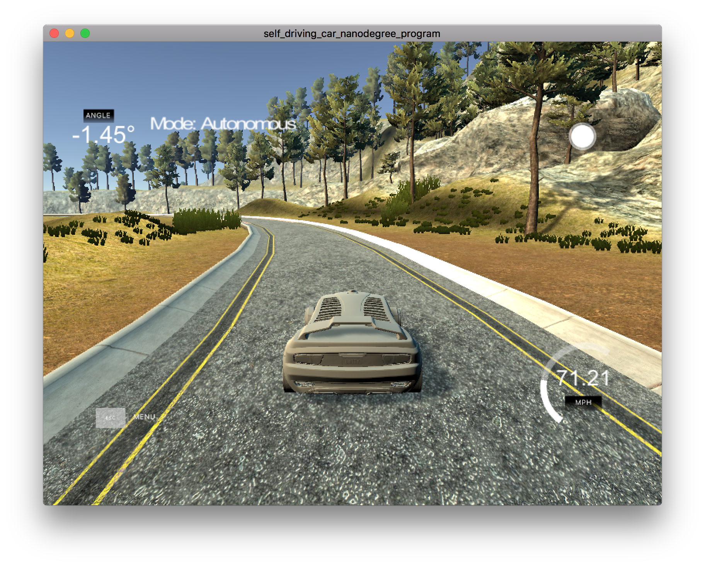
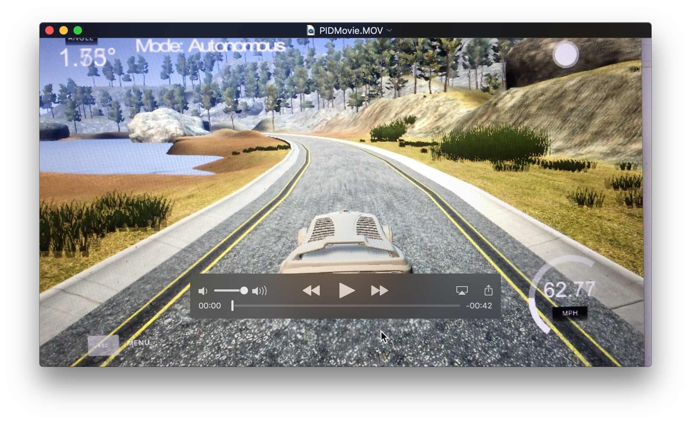

# PID Controller Project

[](http://www.udacity.com/drive)

Overview
---
This repository contains my submission for the PID Controller Project, which is part of the curriculum for term 2 of the Udacity Self-Driving Car Engineer Nanodegree Program. The goal of this project is to implement a PID controller in C++ to maneuver the vehicle around the lake race track from the behavioral cloning [project](https://github.com/alangordon258/SelfDrivingCar-Term1-Proj3) in term1. The simulator provides the cross track error (CTE) and the velocity (mph) in order to compute the appropriate steering angle. See the project rubric [here](https://review.udacity.com/#!/rubrics/824/view). 


[//]: # (Image References)


### How The Steering Coefficients Were Determined
I knew from my study of harmonic systems as an undergraduate engineering student that the coefficient Kp was the equivalent of a spring constant and Kd was the equivalent of a damping coefficient. My intuition told me that the integral coefficient Ki would be small and that the control response of the vehicle would be dominated by the spring and damping terms. 

 In terms of a starting point for the coefficients, I needed to determine the magnitudes of the proportional, derivative, and integral errors. I added logic to return the maximum error each term after driving a lap, which I found to be about 2000 steps at the default throttle setting of 0.3. In order to get the car around at least once so I could determine the magnitude of the errors, I needed to come up with a set of coefficients that would keep the car on the track for one lap. I started by guessing the following values:

| PID Coeff | Coeff. Value |
|:-----:|:-------------:|
| Kp  | 1.0  |
| Kd  | 1.0  |
| Ki  | 0.0  |

With these values the car didn’t stay on the track for very long. I could see from how the car was whipping quickly back and forth that the spring coefficient (Kp) was too high. So I cut it in half to 0.5 and tried again. With these values, the car went farther, but still went off the track before it got to the bridge. I cut Kp in half again to 0.25 and I was able to get  the car around the track (weaving back and forth the whole way) using the default throttle setting (0.3) with the following coefficients:

| PID Coeff | Coeff. Value |
|:-----:|:-------------:|
| Kp  | 0.25  |
| Kd  | 1.0  |
| Ki  | 0.0  |

With the car going all the way around now, I could see that the maximum proportional error was of the order of magnitude 10^0 (between 1 and 10), the maximum derivative error was of the order 10^-1 (between 0.1 and 1), and the maximum integral error was of the order 10^2 (between 100 and 1000). If we assume that the control output is between -1 and 1,  then it follows that the Kp must be of order 10^-1, Kd must be of order 10^0, and Ki must be of order 10^-3. I wanted the result of multiplying Ki by the integral error to be at least an order of magnitude less than the other parameters so I reduced that to 10^-4. Hence I adjusted my initial set of parameters to the following:

| PID Coeff | Coeff. Value |
|:-----:|:-------------:|
| Kp  | 0.25  |
| Kd  | 1.0  |
| Ki  | 0.0001  |

Please note that in my code I turned the parameters Kp, Kd, and Ki into an array p of size 3 as follows: 
```sh
p[0]=Kp, p[1]=Kd, and p[2]=Ki.
```
Technically, I could have thrown up my hands here and declared victory, but the car was weaving a lot, I wanted to try twiddle, and more importantly, I wanted the car to go much faster. I knew that I could reduce the weaving by increasing the damping, so I increased Kd to 2.0 and then to 3.0. At this point the car was driving well enough that I started increasing the speed. I was able to get the car to go around the track at a static throttle setting of 0.6 (twice the default value), albeit with some lurid slides at the corner leading on to the main straight, by decreasing Kp to 0.15 in .05 increments. So my set of coefficients at this point were:

| PID Coeff | Coeff. Value |
|:-----:|:-------------:|
| Kp  | 0.15  |
| Kd  | 3.0  |
| Ki  | 0.0001  |

At this point, the car was driving quite well and given that the car was clearly at the limit of adhesion in the corner entering the main straight, I figured that I was going to be hard pressed to improve things further using twiddle. I tried anyway and sure enough the coefficients didn’t change significantly after a large number of loops.  

| PID Coeff | Coeff. Value |
|:-----:|:-------------:|
| Kp  | 0.15  |
| Kd  | 3.0327  |
| Ki  | 0.00010729  |

The code containing my implementation of twiddle can be found [here](./src).

### How The Throttle Coefficients Were Determined
I figured at this point the only way to go faster was to use a PID controller for the throttle. Since I knew that the maximum throttle value I could achieve with a static throttle was 0.6, I decided to start with a constant value of 0.65 adjusted by a control value that subtracted from this amount by a value that was proportional to the cte and the derivative and integral of the cte just like the steering. One significant difference between the throttle and the steering is that it is not signed. So I used the absolute value of the cte. I modified my PID class so that I could pass a parameter to the Init class that specified whether twiddle was to be run or not. So I froze my steering values and started with the following values for the throttle PID controller (note that I assumed that the bias was zero):

| PID Coeff | Coeff. Value |
|:-----:|:-------------:|
| Kp  | 0.10  |
| Kd  | 1.0  |
| Ki  | 0.0  |

In this case I started with the knowledge that the control response should be less than 0.65 and that the proportional error was 10 times larger than the derivative error. The car actually was going too slow at this point. I questioned whether Kd was even needed for the throttle. So I changed the Kd value to zero. This worked and the car went faster and was driving quite well. I eventually increased the constant part of the throttle to 0.75 and increased Kp to 0.2. So my final throttle coefficients were as follows: 

| PID Coeff | Coeff. Value |
|:-----:|:-------------:|
| Kp  | 0.20  |
| Kd  | 0.0  |
| Ki  | 0.0  |

The final equation for the throttle value was therefore as follows:
```sh
throttle_value = 0.75 - Kp*ErrorP - Kd*ErrorD - Ki*ErrorI
```
### A Final Tuning with Twiddle
At this point the car was achieving better than 70 mph on the (relatively) straight section of the track and was sliding through several turns at the limit of adhesion. I figured it would be difficult to go faster without being more heavy handed with the brake, which would spoil the fun and ruin the overall lap time even if it might allow me to achieve a higher speed on the straight. The car was weaving a little bit now as the coefficients for the steering PID controller were optimized for a lower speed. So I froze the throttle controller coefficients to those outlined above and ran twiddle again for the steering starting with the coefficients that I had determined previously. I thought I needed to add more damping, but twiddle actually reduced both Kp and Kd slightly to the following values:

Kp=0.135
Kd=2.72943
Ki=0.00011

At this point I decided to declare victory. A video of my car can be see here: 
[](./PIDMovie.MOV)

I did discover one more thing when I tried to capture a video of my car on my MacBook. The software does not have a preset sample rate, it just samples as fast as it can. So if anything caused the frequency of the control input to change (such as running video capture software of the machine on which it is running), it would cause the car to crash. This is what happened to me whenever I tried to capture video of speedy car using QuickTime. Running the QuickTime recorder would slow down the sample rate enough to cause the car to crash. This was an important discovery because it raises the possibility that the car will crash when it is run on a different computer by the person grading the assignment. I'll turn the assignment in and see what happens.